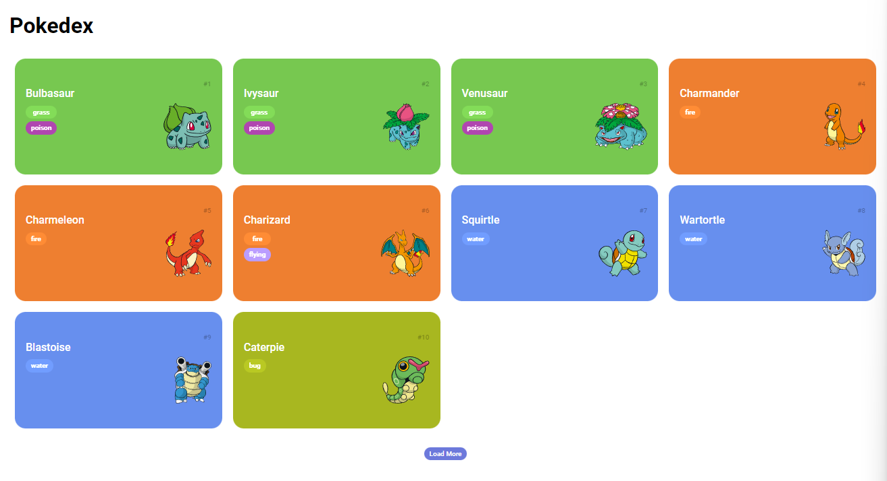
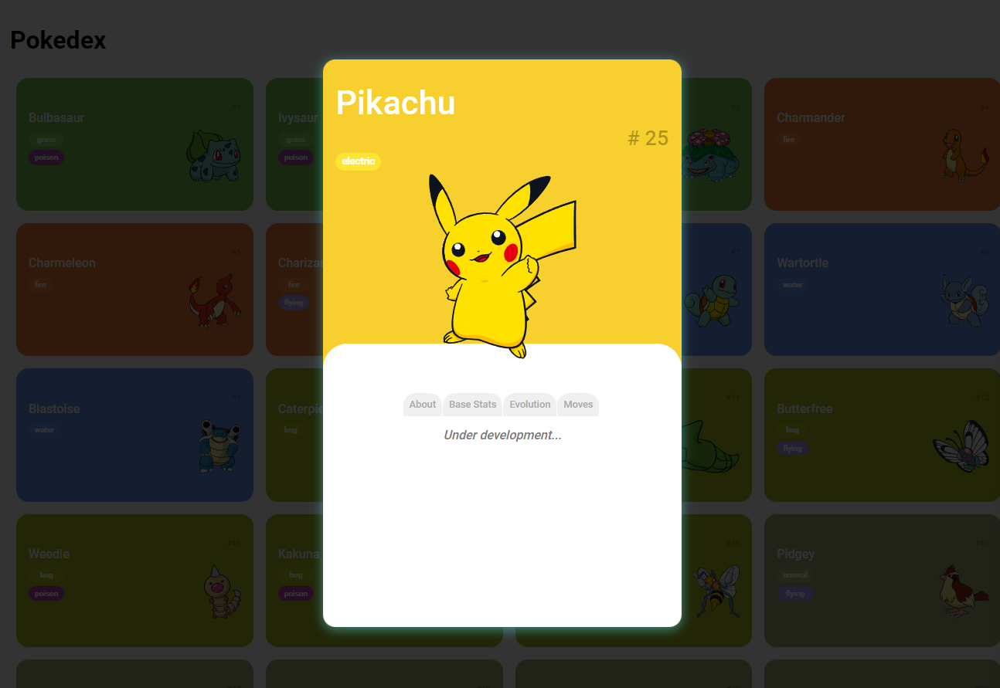

# Pokedex com JavaScript

📃 Descrição

Projeto desenvolvido durante treinamento na plataforma DIO em parceria com iFood que realiza consumo da ```API``` dos Pokemons ```pokeapi.co```

 - Consumindo API Pokemon
 - Manipulando o resultado da requisição através de uma Promisse
 - Transformando requisição em lista HTML
 - Utilizando Map para dimininuir a verbosidade do código
 - Manipulando múltiplas requisições


## 🚀 Tecnologias

- HTML
- CSS
- JavaScript

## 💻 Projeto

[Visualizar projeto em execução](https://wsawebmaster.github.io/js-pokedex/)


Modal do Desafio


## 📌 Informações adicionais
- Clique sobre o botão Load More para que seja exibido mais 10 pokemons
- Clique sobre a imagem do Pokemon para visualizar o Card

## Links
[Normalize](https://cdnjs.com/libraries/normalize)

[API Pokemon Endpoint](https://pokeapi.co/api/v2/pokemon)

[Endpoint utilizado](https://pokeapi.co/api/v2/pokemon?offset=0&limit=10)

[API Pokemon Documentation](https://pokeapi.co/docs/v2#info)
